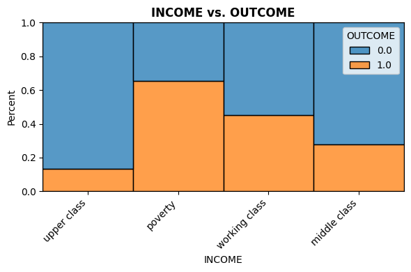
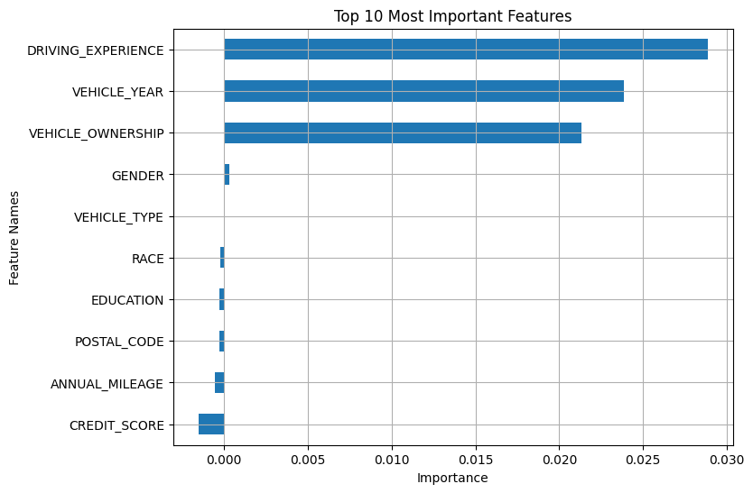
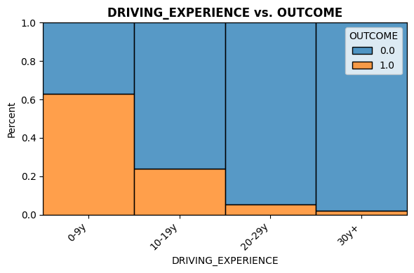

# 🚗 Car Insurance Claim Prediction

**Author:** Yazan Maghary  
**Date:** 05/16/2026  
**Dataset:** [Car Insurance Data — Kaggle](https://www.kaggle.com/datasets/sagnik1511/car-insurance-data)

---

## 📋 Table of Contents
1. [About the Dataset](#about-the-dataset)
2. [Project Structure](#project-structure)
3. [Data Cleaning](#data-cleaning)
4. [Exploratory Data Analysis](#exploratory-data-analysis)
5. [Preprocessing](#preprocessing)
6. [Modeling & Evaluation](#modeling--evaluation)
7. [Feature Insights](#feature-insights)
8. [Conclusion](#conclusion)

---

## 📦 About the Dataset

The dataset contains annual car insurance data with **10,000 records** and **19 features**.

The target column `OUTCOME` indicates:
- `1` → Customer **filed** an insurance claim
- `0` → Customer did **not** file a claim

| Property | Value |
|----------|-------|
| Total Records | 10,000 |
| Features | 19 |
| Target | OUTCOME (Binary Classification) |
| Class Distribution | 68.7% Unclaimed / 31.3% Claimed |
| Missing Values | CREDIT_SCORE (982), ANNUAL_MILEAGE (957) |

---

## 🗂️ Project Structure

```
PROJECT2/
├── Data/
│   └── Car_Insurance_Claim.csv
├── notebook/
│   └── project.ipynb
├── src/
│   ├── class_eva_fun.py
│   ├── eda_utils.py
│   ├── ins_stakeholder.py
│   └── reg_fun.py
└── README.md
```

---

## 🧹 Data Cleaning

| Check | Result |
|-------|--------|
| Duplicated values | ✅ None found |
| Null values | ⚠️ CREDIT_SCORE (9.82%), ANNUAL_MILEAGE (9.57%) |
| Inconsistent values | ✅ None found |
| High cardinality | ✅ None found |
| Data types | ✅ Correct |
| Outliers | ⚠️ Detected via boxplot → handled with median imputation |

> **Important:** Null values were **not imputed during cleaning** to prevent data leakage.  
> Imputation was deferred to the preprocessing pipeline after the train/test split.

---

## 📊 Exploratory Data Analysis

### EDA Visual 1 — Driving Experience vs Claim Outcome

> Customers with **less driving experience (0-9y)** are significantly more likely to file claims compared to experienced drivers (30y+). This makes strong business sense — inexperienced drivers are statistically higher risk.

```
DRIVING_EXPERIENCE
0-9y      → Highest claim rate   ❌
10-19y    → Moderate claim rate
20-29y    → Lower claim rate
30y+      → Lowest claim rate    ✅
```


---

### EDA Visual 2 — Income vs Claim Outcome

> Customers in the **poverty** and **working class** income groups show a notably higher claim rate than those in the **middle** and **upper class**. Income level is a strong predictor of claim behavior.

```
INCOME
poverty       → Highest claim rate   ❌
working class → High claim rate
middle class  → Lower claim rate
upper class   → Lowest claim rate    ✅
```



---

## ⚙️ Preprocessing

### Train/Test Split
```
Test size : 20%
Train     : 8,000 records
Test      : 2,000 records
```

### Encoding Strategy

| Column | Type | Encoder | Order |
|--------|------|---------|-------|
| GENDER, RACE, VEHICLE_TYPE | Nominal | OneHotEncoder | — |
| AGE | Ordinal | OrdinalEncoder | 16-25 → 26-39 → 40-64 → 65+ |
| DRIVING_EXPERIENCE | Ordinal | OrdinalEncoder | 0-9y → 10-19y → 20-29y → 30y+ |
| EDUCATION | Ordinal | OrdinalEncoder | none → high school → university |
| INCOME | Ordinal | OrdinalEncoder | poverty → working class → middle class → upper class |
| VEHICLE_YEAR | Ordinal | OrdinalEncoder | before 2015 → after 2015 |
| CREDIT_SCORE, ANNUAL_MILEAGE | Numeric | SimpleImputer (median) + StandardScaler | — |

### Class Imbalance — SMOTE
```
Before SMOTE:  68.7% Unclaimed / 31.3% Claimed
After SMOTE:   50%   Unclaimed / 50%   Claimed
```
SMOTE was applied **inside the pipeline** on training data only to prevent data leakage.

---

## 🤖 Modeling & Evaluation

### Model: Random Forest Classifier + RandomizedSearchCV

```python
params = {
    'n_estimators'      : [100, 200, 300],
    'max_depth'         : [3, 5, 10, 15, 20],
    'min_samples_split' : [2, 5, 10],
    'max_features'      : ['sqrt', 'log2']
}
# n_iter=100, cv=5, scoring='recall'
```

### Why Recall?

> In car insurance, a **False Negative** (missing a real claim) is far more costly than a **False Positive**.  
> Missing a real claim means the company is **financially unprepared**.  
> Therefore, **Recall is our primary optimization metric.**

### Results — Default Threshold (0.5)

| Class | Precision | Recall | F1-Score | Support |
|-------|-----------|--------|----------|---------|
| Unclaimed | 0.90 | 0.82 | 0.86 | 5,500 |
| Claimed | 0.67 | 0.81 | 0.73 | 2,500 |
| **Accuracy** | | | **0.82** | 8,000 |

| Class | Precision | Recall | F1-Score | Support |
|-------|-----------|--------|----------|---------|
| Unclaimed | 0.89 | 0.82 | 0.85 | 1,367 |
| Claimed | 0.67 | 0.78 | 0.72 | 633 |
| **Accuracy** | | | **0.81** | 2,000 |

### Threshold Tuning — Optimized for Recall

By lowering the decision threshold, we boosted recall significantly:

| Metric | Before (0.5) | After (0.3) |
|--------|-------------|-------------|
| Claimed Recall | 0.78 | **0.93** ✅ |
| Claimed Precision | 0.67 | 0.51 |
| Accuracy | 0.81 | 0.70 |
| Overfitting | Train/Test diff < 1% ✅ | Train/Test diff < 1% ✅ |

> The tuned model catches **93% of real claims** — ideal for an insurance business where missing a claim is the worst outcome.

---

## 🔍 Feature Insights

### Feature Importance Visual 1 — Permutation Importance (Top 10)

> Permutation importance measures how much model performance drops when a feature is shuffled. The top 3 features make strong business sense.

| Rank | Feature | Importance | Business Sense |
|------|---------|------------|----------------|
| 1 | DRIVING_EXPERIENCE | 0.02885 | ✅ Less experience = higher risk |
| 2 | VEHICLE_YEAR | 0.02385 | ✅ Older cars = higher risk |
| 3 | VEHICLE_OWNERSHIP | 0.02135 | ✅ Owners are more careful |
| 4–10 | GENDER, RACE, EDUCATION... | ~0.000 | ⚠️ Near zero — model is fair |



---

### Feature Importance Visual 2 — Driving Experience vs Claim (Top Feature)

> The most important feature confirms our EDA finding — inexperienced drivers (0-9y) have the highest claim rate, while veteran drivers (30y+) have the lowest.



> **Key Observation:** Demographic features (GENDER, RACE) show near-zero importance — indicating the model makes decisions based on **behavior and risk factors**, not demographic attributes. This is a critical fairness requirement for regulated insurance models.

---

## ✅ Conclusion

| Item | Result |
|------|--------|
| Best Model | Random Forest + Threshold Tuning |
| Claimed Recall (Test) | **0.93** ✅ |
| Overfitting | None — Train/Test diff < 1% ✅ |
| Top Predictor | DRIVING_EXPERIENCE |
| Model Fairness | ✅ Demographic features near zero importance |

> The final model successfully identifies **93% of customers who will file a claim**, making it well-suited for deployment in a real insurance pricing and risk assessment pipeline.
